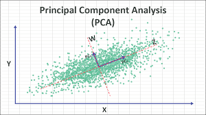
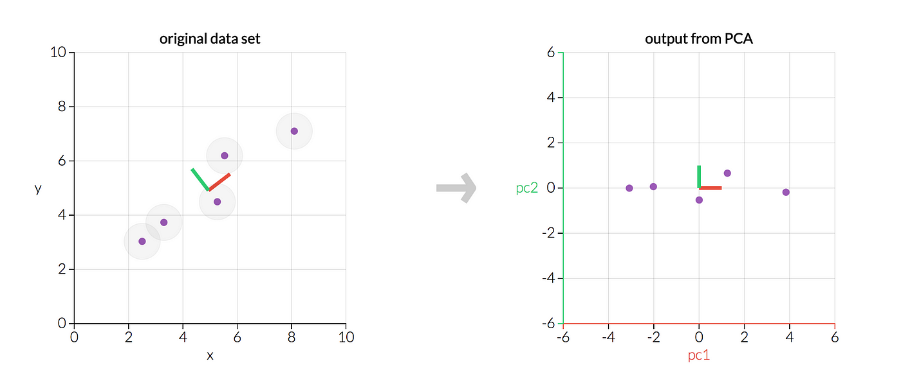
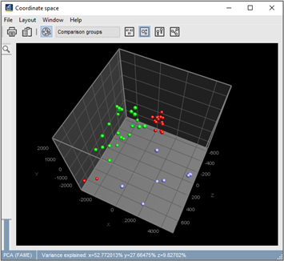

# Recommender System Using PCA and Logistic Regression

## Logos


## Project Overview

This project involves developing a wine recommender system that classifies and recommends wines to new customers. The approach includes clustering the dataset, reducing dimensionality with Principal Component Analysis (PCA), and applying a logistic regression classifier. The model achieves an impressive accuracy of 98%.



## Table of Contents

- [Introduction](#introduction)
- [Installation](#installation)
- [Dataset](#dataset)
- [Data Preprocessing](#data-preprocessing)
- [Applying PCA](#applying-pca)
- [Model Training](#model-training)
- [Evaluation](#evaluation)
- [Visualization](#visualization)
- [Results](#results)
- [Contributing](#contributing)
- [License](#license)
- [Owner](#owner)

## Introduction

This project leverages Principal Component Analysis (PCA) and Logistic Regression to create a wine recommender system. By reducing the dataset's dimensionality and applying a classification algorithm, the system can recommend wines to new customers with high accuracy.

## Installation

To run this project, you need to have the following libraries installed:

- NumPy
- Pandas
- Matplotlib
- scikit-learn

You can install the required libraries using pip:
```sh
pip install numpy pandas matplotlib scikit-learn
```

## Dataset

The dataset used in this project is `Wine.csv`, which contains various features of wines and their classifications.

## Data Preprocessing

### Importing the Dataset

The dataset is imported and feature and target variables are extracted.

```python
import pandas as pd
dataset = pd.read_csv('Wine.csv')
X = dataset.iloc[:, :-1].values
y = dataset.iloc[:, -1].values
```

### Splitting the Dataset

The dataset is split into training and test sets.

```python
from sklearn.model_selection import train_test_split
X_train, X_test, y_train, y_test = train_test_split(X, y, test_size = 0.2, random_state = 0)
```

### Feature Scaling

Standardization is applied to the feature variables.

```python
from sklearn.preprocessing import StandardScaler
sc = StandardScaler()
X_train = sc.fit_transform(X_train)
X_test = sc.transform(X_test)
```

## Applying PCA

Dimensionality reduction is performed using PCA, reducing the dataset to 2 principal components.

```python
from sklearn.decomposition import PCA
pca = PCA(n_components = 2)
X_train = pca.fit_transform(X_train)
X_test = pca.transform(X_test)
```

## Model Training

The logistic regression classifier is trained on the training set.

```python
from sklearn.linear_model import LogisticRegression
classifier = LogisticRegression(random_state = 0)
classifier.fit(X_train, y_train)
```

## Evaluation

The model's performance is evaluated using a confusion matrix and accuracy score.

```python
from sklearn.metrics import confusion_matrix, accuracy_score
y_pred = classifier.predict(X_test)
cm = confusion_matrix(y_test, y_pred)
print(cm)
print('Accuracy:', accuracy_score(y_test, y_pred))
```

## Visualization

The results of the model are visualized for both training and test sets.

### Training Set Visualization

```python
from matplotlib.colors import ListedColormap
import numpy as np
import matplotlib.pyplot as plt

X_set, y_set = X_train, y_train
X1, X2 = np.meshgrid(np.arange(start = X_set[:, 0].min() - 1, stop = X_set[:, 0].max() + 1, step = 0.01),
                     np.arange(start = X_set[:, 1].min() - 1, stop = X_set[:, 1].max() + 1, step = 0.01))
plt.contourf(X1, X2, classifier.predict(np.array([X1.ravel(), X2.ravel()]).T).reshape(X1.shape),
             alpha = 0.75, cmap = ListedColormap(('red', 'green', 'blue')))
plt.xlim(X1.min(), X1.max())
plt.ylim(X2.min(), X2.max())
for i, j in enumerate(np.unique(y_set)):
    plt.scatter(X_set[y_set == j, 0], X_set[y_set == j, 1],
                c = ListedColormap(('red', 'green', 'blue'))(i), label = j)
plt.title('Logistic Regression (Training set)')
plt.xlabel('PC1')
plt.ylabel('PC2')
plt.legend()
plt.show()
```

### Test Set Visualization

```python
X_set, y_set = X_test, y_test
X1, X2 = np.meshgrid(np.arange(start = X_set[:, 0].min() - 1, stop = X_set[:, 0].max() + 1, step = 0.01),
                     np.arange(start = X_set[:, 1].min() - 1, stop = X_set[:, 1].max() + 1, step = 0.01))
plt.contourf(X1, X2, classifier.predict(np.array([X1.ravel(), X2.ravel()]).T).reshape(X1.shape),
             alpha = 0.75, cmap = ListedColormap(('red', 'green', 'blue')))
plt.xlim(X1.min(), X1.max())
plt.ylim(X2.min(), X2.max())
for i, j in enumerate(np.unique(y_set)):
    plt.scatter(X_set[y_set == j, 0], X_set[y_set == j, 1],
                c = ListedColormap(('red', 'green', 'blue'))(i), label = j)
plt.title('Logistic Regression (Test set)')
plt.xlabel('PC1')
plt.ylabel('PC2')
plt.legend()
plt.show()
```



## Results

- **Confusion Matrix:** The confusion matrix is used to describe the performance of the classifier.
- **Accuracy:** The model achieves an accuracy of 98%, indicating its effectiveness in recommending wines to new customers.

## Contributing

If you wish to contribute to this project, please fork the repository and submit a pull request. For major changes, please open an issue first to discuss what you would like to change.

## License

This project is licensed under the MIT License - see the [LICENSE](LICENSE) file for details.

## Owner

- **Name:** Yuvraj Singh Chowdhary
- **LinkedIn:** [Yuvraj Singh Chowdhary](https://www.linkedin.com/in/yuvraj-singh-chowdhary/)
- **GitHub:** [chowdhary19](https://github.com/chowdhary19)

---

This README provides a comprehensive overview of the wine recommender system project, instructions for installation, and detailed steps for data preprocessing, model training, evaluation, and visualization. It also includes contact information for the project owner and links to relevant profiles.
